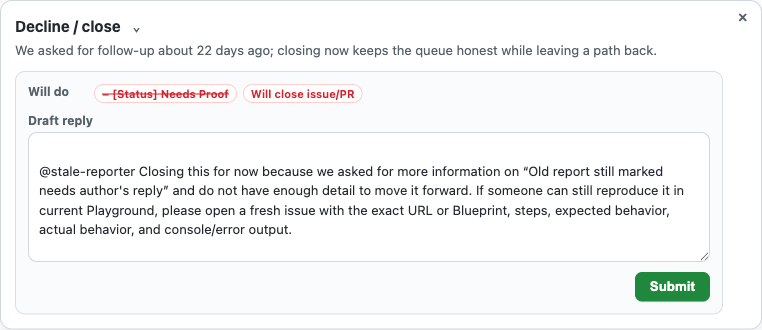

# GitHub Triage Copilot MVP

Local-first GitHub triage assistant for WordPress Playground issue/PR stewardship.

This MVP is intentionally restricted to `WordPress/wordpress-playground`.

It has two pieces:

- **Chrome extension** (`extension/`) that injects triage UI into GitHub issue/PR lists and detail pages.
- **Local companion service** (`server/`) that stores suggestions in SQLite, fetches current GitHub context through `gh`, and optionally asks Codex for a structured triage proposal.

The extension never mutates GitHub directly. Submitting actions goes through the local server and is disabled unless `TRIAGE_ALLOW_APPLY=1` is set.

## Quick start

```bash
cd server
python3 server.py
```

If the extension cannot reach the local companion, GitHub will show **Start local companion** on detail pages and **Start server** on list rows. Start the command above and refresh GitHub.

Then load the unpacked extension from:

```text
extension/
```

Open a `WordPress/wordpress-playground` issue or PR page. A compact **Next action** control should appear.

The default UI is intentionally compact: list pages show a **Next action: [what to do]** preview button, and detail pages lead with the reviewer action to take now, a short private rationale, and an inline editable draft reply when a public reply is useful. The action title itself opens a menu for swapping to a different stewardship action.

Detail panels can be minimized or closed for the current page, and **Reconsider** forces a fresh local recommendation instead of reusing the cached result.

The panel shows the evidence it used, including code size and possible duplicates. PRs show changed files and line counts; issues without a patch say that no files or lines changed and route to proof/owner/duplicate/design work rather than code-review sizing; issues with candidate PRs show candidate PR sizes, reproduction signal, review state, and the resulting suggested action.

For **Fast merge** and **Medium review** suggestions, the panel also shows **Ask Codex to reproduce**. That button asks the local companion to open a temporary reproduction workspace in Codex Desktop when the app is installed, and starts the runnable Codex session in Terminal.app so the prompt executes immediately. The prompt tells Codex not to mutate GitHub and to try `https://playground.wordpress.net` first when that is the smallest useful reproduction path.

The action switcher uses operator-oriented labels such as **None needed**, **Wait for response**, **Review the PR**, **Review narrow PR**, **Ask for details**, and **Close as duplicate** instead of queue names alone. More specific paths such as candidate PRs, re-review, no-capacity, or narrow-fast-path appear as inferred suggestions and evidence, not as every option in the menu.

## Screenshot



## Stewardship actions covered

- **Fast merge**: small, tested, owned by a clear area, and low product/design risk.
- **Medium review**: in scope and concrete, but not fast-track; needs a review budget, tests/manual verification, and rollback notes.
- **Ask for reproduction**: needs steps, logs, benchmark, or proof before review.
- **Needs design acceptance**: public API, product direction, or architecture needs agreement before implementation review.
- **Accepted design, needs execution plan**: direction may be accepted, but implementation review still needs slices, owners, tests, and rollback boundaries.
- **Close quickly**: stale after follow-up, out of scope, insufficient information, or otherwise not actionable.
- **Waiting on contributor**: a maintainer already asked for something; no new public action yet, just wait until the follow-up window expires.
- **Has candidate PR**: the issue already has an implementation path; route review through that PR.
- **Needs re-review**: the author responded after reviewer feedback; ask the previous reviewer or area maintainer to re-test.
- **Choose PR path**: multiple PRs address the same issue; pick one path before asking for more review.
- **Use narrow fix first**: a small patch and broader patch compete; prefer the smallest patch that fully resolves the report.
- **Find an owner**: plausible work, but no clear accountable owner/reviewer yet.
- **Useful, no capacity**: aligned work, but maintainers should not imply available review capacity without an owner.
- **Duplicate of**: close while pointing to the canonical issue when a likely duplicate is found.
- **No action**: already handled, closed, merged, or no mutation needed.

The companion only proposes label mutations for labels that currently exist in the Playground repository. Other stewardship states remain visible as panel state and draft wording rather than invented labels.

## What the local companion does

The Chrome extension cannot run local tools by itself. The companion is a small Python HTTP service on `127.0.0.1:8765` that:

- receives the current GitHub repo, issue/PR number, and page context from the extension;
- fetches fuller issue/PR context with the local `gh` CLI when available;
- stores suggestion results in `server/triage.sqlite3` so refreshes do not recompute unchanged items;
- returns the suggested action, private rationale, draft public comment, and proposed operations;
- optionally invokes `codex exec` when `TRIAGE_PROVIDER=codex` is set;
- opens a local Codex reproduction workspace/session from **Ask Codex to reproduce**;
- optionally applies operations through `gh` only when `TRIAGE_ALLOW_APPLY=1` is set.

By default it uses the deterministic heuristic provider and does not need Codex or any API key.

## Publishing and secrets

This repository is safe to publish as source code. It should not contain tokens, API keys, cookies, GitHub credentials, or Codex credentials. Runtime state such as `server/triage.sqlite3`, `__pycache__/`, and zip artifacts are ignored by `.gitignore` and excluded from the packaged release zip.

The extension requests host access only for `https://github.com/WordPress/wordpress-playground/*` and the local companion URL (`http://127.0.0.1:8765/*`). GitHub mutations are disabled by default and require starting the companion with `TRIAGE_ALLOW_APPLY=1`.

## Optional Codex provider

By default the server uses a deterministic local heuristic provider so the UI can be tested without spending tokens.

To use Codex CLI suggestions:

```bash
TRIAGE_PROVIDER=codex python3 server.py
```

The Codex provider runs `codex exec` with a JSON output schema and stores results in SQLite keyed by the current item fingerprint.

## Optional apply mode

To actually post comments, add labels, or close issues/PRs through `gh`:

```bash
TRIAGE_ALLOW_APPLY=1 python3 server.py
```

The extension shows the exact operations before applying. Move-to-discussion remains manual in this MVP.

## Local data

SQLite database:

```text
server/triage.sqlite3
```

Cache keys include the repo, item type, number, state, labels, updated timestamp, current body, recent comments/reviews, PR draft state, and PR head SHA when available.
